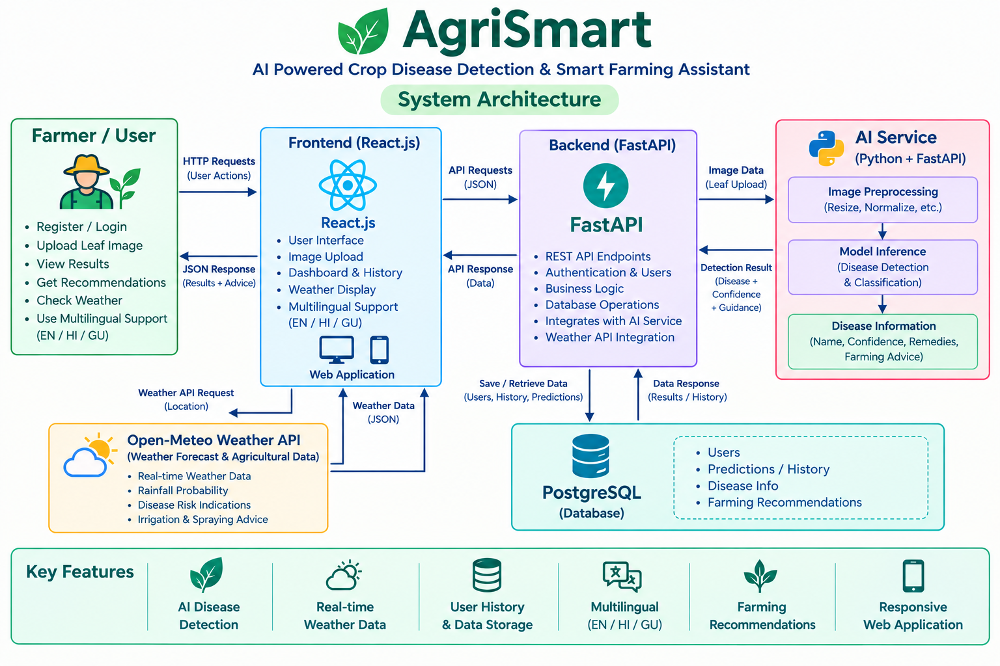

# 🌾 AgriSmart AI - Intelligent Agriculture for a Sustainable Future

> **SIH 2026 Internal Hackathon** | L. J. Institute of Engineering and Technology [C-433]

> **Problem Statement 1**: AI-Powered Crop Disease Detection Tool & Smart Agriculture Advisory Platform

---

## 📌 1. Modules Built

### Mandatory Core Task

- **Crop Disease Detection (Computer Vision)**: Image-based crop disease detection that accepts a leaf image and returns a disease class, confidence score, severity information, and actionable organic/chemical cure recommendations.

### Bonus Modules Implemented

- [x] **Bonus Module E: Farmer Assistant (GenAI)**: Actionable organic & chemical precautionary guidance in plain language.
- [x] **Bonus Module C: Weather-Based Risk Advisor**: Smart treatment advice considering humidity & rainfall risks.
- [x] **Multilingual Farmer Support**: Interface available in English, Hindi, and Gujarati for improved accessibility.

---

## ⏱️ 2. Quick Setup & Evaluation Run (Under 2 Minutes)

Judges can execute the application using the following commands.

### Prerequisites

pip install -r requirements.txt

### Mandatory Predict Interface Command

python predict.py --image path/to/leaf_sample.jpg

### Run Web Interface API Server

python app.py

Open http://localhost:8000 in your browser to access the interactive AgriSmart Web Dashboard.

### Full Application

The complete application can also be run using the frontend, backend, and AI service components described in the project architecture.

---

## 📊 3. Dataset & Sources

- **Training / Reference Dataset**: PlantVillage Dataset (~54,000 leaf images across multiple crop and disease classes).
- **Field-Condition Evaluation**: Real-world field-condition images representing natural lighting, background variation, clutter, and occlusion.
- **Dataset Source**: Publicly available PlantVillage and field-condition agricultural image datasets.
- **Licence**: Public/open-access datasets and resources are used in accordance with their respective terms and licenses.

---

## 📈 4. Model Evaluation

The AgriSmart AI system provides an image-based crop disease detection pipeline with disease classification, confidence scoring, severity information, and actionable treatment guidance.

The evaluation interface is designed to accept a new leaf image and return the predicted disease class through the predict.py interface.

Model evaluation using the challenge's held-out field-condition test set, including macro-F1, accuracy, confusion matrix, and per-class precision/recall, is part of the evaluation workflow.

The current submission focuses on the complete end-to-end application, AI inference service, farmer-oriented recommendations, multilingual support, weather intelligence, and reproducible execution pipeline.

---

## 🏗️ 5. Architecture Overview & Limitations

### Architecture Overview

AgriSmart AI follows a modular web-based architecture consisting of:

- **React Frontend** for farmer interaction, authentication, image upload, disease analysis, history, and weather information.
- **FastAPI Backend** for authentication, image processing, prediction orchestration, database operations, and service communication.
- **AI Service** for image processing and crop disease detection.
- **PostgreSQL Database** for user information, disease information, and prediction history.
- **Weather API Integration** for weather conditions, rainfall probability, disease-risk indications, irrigation advice, and spraying guidance.
- **Multilingual Support** for English, Hindi, and Gujarati.

### Inference Pipeline

Leaf Image → Image Processing → AI Disease Detection → Disease Class + Confidence → Disease Information Mapping → Severity + Symptoms + Organic Cure + Chemical Cure + Prevention

### Known Limitations

- Prediction confidence may be reduced for extremely low-light images.
- Heavily mud-splattered or severely occluded leaves may affect detection quality.
- Field conditions can differ significantly from controlled image conditions.
- Weather recommendations depend on the availability and accuracy of external weather data.
- The system provides agricultural guidance as decision support and does not replace professional agricultural consultation.

---

## 🔗 6. Demo Video & Deployment Links

- **Live Web Application**: http://localhost:8000 (Local Development)
- **Demo Video (3–5 min)**: Insert Unlisted YouTube / Drive link here

---

## 📜 7. Originality Declaration

All substantive project development for this submission was carried out during the hackathon window (10–15 September 2026).

Open-source libraries, frameworks, public datasets, and pretrained resources are used where applicable and are acknowledged in the project documentation.

The project was developed specifically for the SIH 2026 Internal Hackathon problem statement.

---

## 🏗️ System Architecture

AgriSmart AI follows a modular web-based architecture designed to provide AI-powered crop disease detection, weather intelligence, multilingual support, and farmer-friendly agricultural guidance.

### Architecture Flow

**Farmer → React Frontend → FastAPI Backend → AI Service → Disease Information → PostgreSQL**

The frontend provides the farmer interface for authentication, image upload, disease analysis, history, and weather information.

The FastAPI backend manages authentication, image processing, prediction orchestration, database operations, and communication with the AI service.

The AI service processes the uploaded crop/leaf image and returns the detected disease information and confidence score.

PostgreSQL stores user information, disease information, and prediction history.

Weather intelligence is integrated through a weather API to provide current weather conditions, rainfall probability, disease-risk indications, irrigation advice, and spraying guidance.

The frontend also provides multilingual support for English, Hindi, and Gujarati to improve accessibility for farmers.